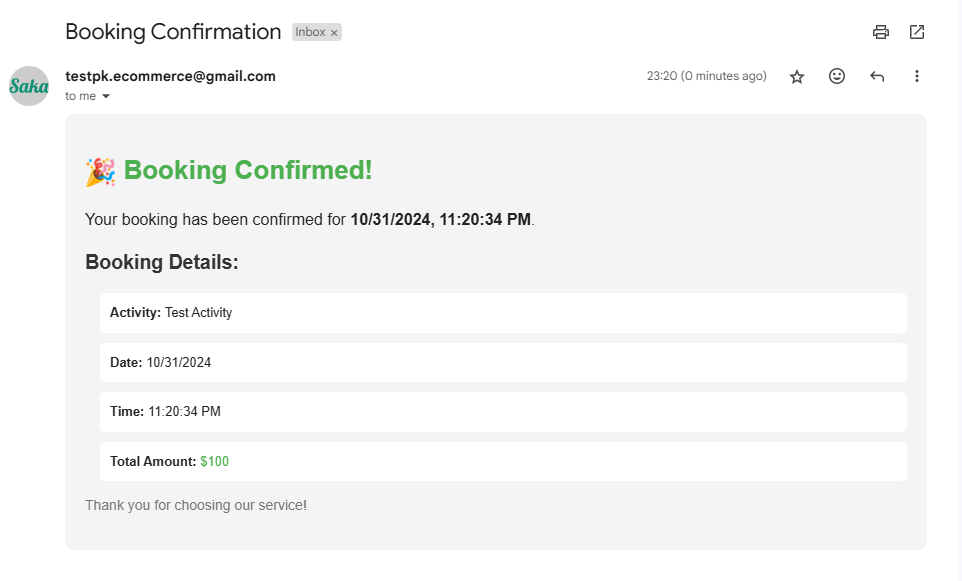
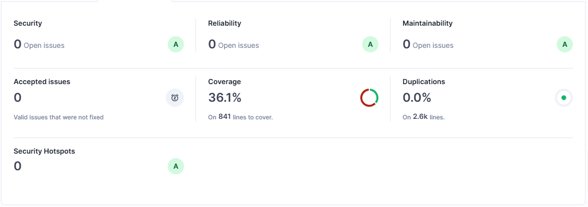

# Childcare Backend API

A robust Express.js API built with TypeScript for managing childcare activities and attendance tracking, featuring secure authentication, data validation, and comprehensive logging.

## Features

- TypeScript for enhanced type safety and developer experience
- Express.js web framework with RESTful API endpoints
- Clerk authentication for secure user management
- MongoDB with Mongoose for data persistence
- Activity management (create, read, update, delete)
- Attendance tracking for activities
- Activity reporting and analytics
- Request validation middleware
- Error handling middleware
- Detailed application logging
- Environment-based configuration

## Prerequisites

- Node.js (version must be greater than 16 and less than 21)
- MongoDB installed and running locally
- Clerk account with API keys

## Project Structure

```
childcare-backend/
├── src/
│   ├── config/
│   │   ├── database.ts
│   │   ├── stripe.ts
│   │   ├── clerk.ts
│   │   └── environment.ts
│   ├── controllers/
│   │   ├── activity.controller.ts
│   │   ├── booking.controller.ts
│   │   └── auth.controller.ts
│   ├── middleware/
│   │   ├── auth.middleware.ts
│   │   ├── error.middleware.ts
│   │   ├── loadBalancer.middleware.ts
│   │   ├── logRequest.middleware.ts
│   │   ├── setCorrelationId.ts
│   │   └── validation.middleware.ts
│   ├── models/
│   │   ├── Activity.ts
│   │   ├── Booking.ts
│   │   └── User.ts
│   ├── routes/
│   │   ├── activity.routes.ts
│   │   ├── booking.routes.ts
│   │   └── auth.routes.ts
│   ├── schemas/
│   │   ├── activity.schema.ts
│   │   ├── booking.schema.ts
│   │   ├── mongodbId.schema.ts
│   │   └── user.schema.ts
│   ├── services/
│   │   └── loadBalancer.ts
│   ├── tests/
│   │   ├── unit/
│   │   │   ├── controller/
│   │   │   │   └── auth.test.ts
│   │   ├── types/
│   │   │   └── Role.ts
│   ├── utils/
│   │   ├── email.ts
│   │   ├── logger.ts
│   │   └── jwt.ts
│   ├── webhooks/
│   │   └── webhook.ts
│   └── app.ts
├── logs/
├── dist/
├── coverage/
├── .env
├── .env.test
├── .env.example
├── .gitignore
├── .npmrc
├── jest.config.ts
├── LICENSE
├── package.json
├── README.md
├── sonar-project.properties
└── tsconfig.json
```

### Directory Structure Explanation

- **src/**: Contains the main application source code

  - **config/**: Configuration files for database, environment variables, etc.
  - **controllers/**: Request handlers for different routes
  - **middleware/**: Custom middleware functions
  - **models/**: Database models and schemas
  - **routes/**: API route definitions
  - **services/**: Business logic layer
  - **utils/**: Helper functions and utilities
  - **types/**: TypeScript type definitions
  - **app.ts**: Main application entry point

- **tests/**: Test files (not implemented)

  - **integration/**: Integration tests (not implemented)
  - **unit/**: Unit tests (auth.controller.ts implemented)

- **logs/**: Application logs directory
- **.env**: Environment variables (not tracked in git)
- **.env.test**: Test environment variables (not tracked in git)
- **.env.example**: Example environment variables template
- **package.json**: Project dependencies and scripts
- **tsconfig.json**: TypeScript configuration
- **sonar-project.properties**: SonarQube configuration

## Getting Started

1. Clone the repository:

   ```bash
   git clone https://github.com/web-shoharab-pk/childcare-backend.git
   ```

2. Install dependencies:

   ```bash
   cd childcare-backend
   npm install
   ```

3. Configure environment variables:
   Create a `.env` file in the root directory with the following:

   ```
   PORT=
   NODE_ENV= # development, production
   MONGO_URI=
   JWT_SECRET=

   CLERK_SECRET_KEY=

   # Cookie settings
   COOKIE_MAX_AGE=
   COOKIE_HTTP_ONLY=
   COOKIE_SECURE=
   COOKIE_NAME=

   SERVER_URL=
   FRONTEND_URL=
   # Stripe
   STRIPE_SECRET_KEY=
   STRIPE_WEBHOOK_SECRET=

   # Email Config
   SMPT_MAIL=
   SMPT_SERVICE=
   SMPT_PASSWORD=
   ```
   Create a `.env.test` file in the root directory with the same variables as `.env` but with test values.
   ```
   # Test environment
   TEST_USER_PASSWORD=
   TEST_USER_EMAIL=
   TEST_USER_WEAK_PASSWORD=
   TEST_USER_WRONG_PASSWORD=
   TEST_USER_NEW_PASSWORD=
   ```

4. Start the development server:
   ```bash
   npm run dev
   ```

The API will be available at `http://localhost:5000`

## API Endpoints

### Health Check

- `GET /health`: Check API health status
  ```json
  {
    "status": "healthy",
    "timestamp": "2024-01-01T00:00:00.000Z",
    "environment": "development",
    "version": "1.0.0",
    "uptime": 1234.56,
    "memory": {
      "heapTotal": 123456789,
      "heapUsed": 987654321,
      "external": 12345,
      "arrayBuffers": 67890
    },
    "cpu": {
      "user": 123456,
      "system": 78901
    },
    "pid": 1234,
    "platform": "darwin",
    "nodeVersion": "v16.x.x"
  }
  ```

### Load Balancer Status

- `GET /loadbalancer/status`: Check load balancer operational status
  ```json
  {
    "status": "operational",
    "timestamp": "2024-11-01T04:22:45.950Z",
    "environment": "production",
    "services": {
      "activity": {
        "instances": ["https://childcare-backend-uyed.render.com"],
        "currentIndex": 0,
        "totalInstances": 1,
        "healthStatus": {
          "https://childcare-backend-uyed.render.com": true
        }
      },
      "booking": {
        "instances": ["https://childcare-backend-uyed.render.com"],
        "currentIndex": 0,
        "totalInstances": 1,
        "healthStatus": {
          "https://childcare-backend-uyed.render.com": true
        }
      },
      "auth": {
        "instances": ["https://childcare-backend-uyed.render.com"],
        "currentIndex": 0,
        "totalInstances": 1,
        "healthStatus": {
          "https://childcare-backend-uyed.render.com": true
        }
      }
    }
  }
  ```

## API Documentation

For detailed API documentation, please visit:
[Postman Documentation](https://documenter.getpostman.com/view/16481716/2sAY4x9gJG)

## Application URL

The application is deployed at:

```
https://childcare-backend-uyed.render.com
```

**Note:** This application is hosted on a free-tier service. During periods of inactivity, the application enters sleep mode to conserve resources. As a result, the first request after a period of inactivity may experience a brief delay while the application restarts. Subsequent requests will perform normally.

## Load Balancer Configuration

While currently operating as a monolithic application, the system is designed with future scalability in mind. The load balancer can be configured using:

```
LOAD_BALANCER_URL=http://localhost:5000
```

## Node Version Requirements

- Supported Node.js versions: >16.x.x and <21.x.x

## Payment Information

When you book an activity, you will receive a payment link. You can use the following Stripe test card details for payment:

- **Card Number:** 4242 4242 4242 4242
- **Expiration Date:** Any future date (e.g., 12/34)
- **CVC:** Any 3-digit number (e.g., 123)
- **ZIP Code:** Any valid postal code (e.g., 12345)

Please ensure to use these test card details only in the testing environment.

## Email Confirmation

After completing your booking, you will receive a confirmation email. Below is an example of what the email will look like:



## SonarQube Test Report

